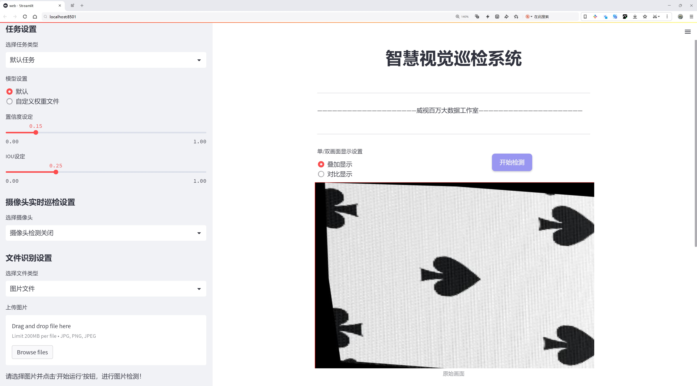
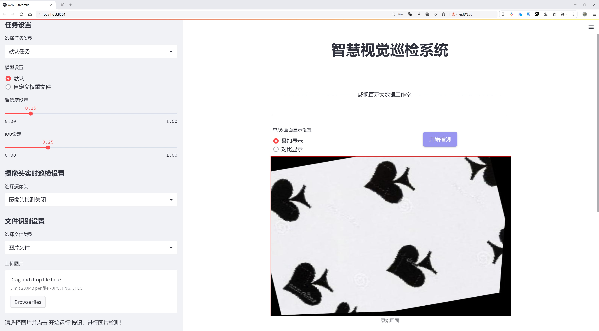
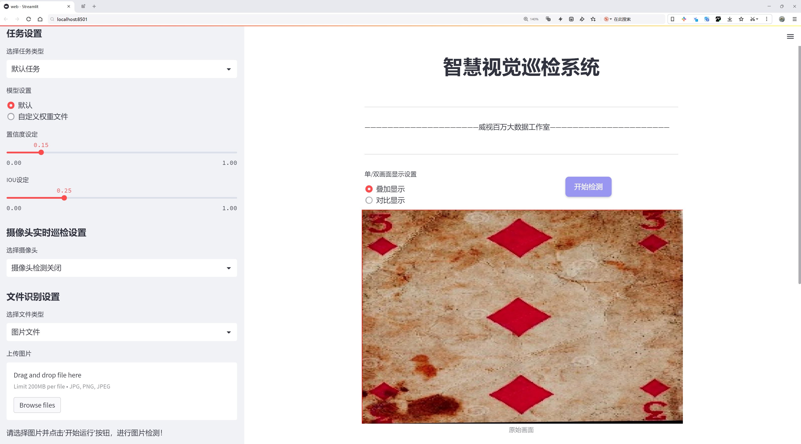
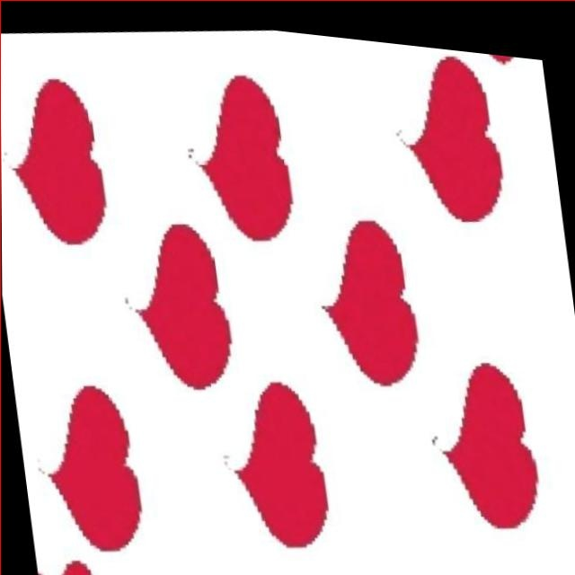
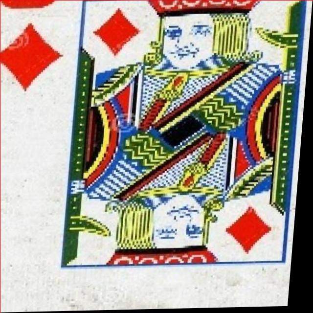

# 扑克牌识别与计数系统源码分享
 # [一条龙教学YOLOV8标注好的数据集一键训练_70+全套改进创新点发刊_Web前端展示]

### 1.研究背景与意义

项目参考[AAAI Association for the Advancement of Artificial Intelligence](https://gitee.com/qunmasj/projects)

项目来源[AACV Association for the Advancement of Computer Vision](https://kdocs.cn/l/cszuIiCKVNis)

研究背景与意义

扑克牌作为一种广泛流行的娱乐和竞技活动，其游戏规则和玩法多样，吸引了大量玩家的参与。在扑克游戏中，牌的识别与计数是实现游戏策略的重要环节，尤其在一些竞技场合，准确的牌面识别和计数能够显著提高玩家的胜率。因此，开发一套高效、准确的扑克牌识别与计数系统，具有重要的理论和实际意义。

近年来，深度学习技术的快速发展为计算机视觉领域带来了革命性的变化，尤其是在物体检测和识别方面。YOLO（You Only Look Once）系列模型以其高效的实时检测能力和较高的准确率，成为了众多视觉任务中的首选模型。YOLOv8作为该系列的最新版本，进一步提升了模型的性能，适应了更复杂的应用场景。然而，针对扑克牌的特定识别任务，YOLOv8仍然面临一些挑战，例如在复杂背景下的牌面识别、不同光照条件下的准确性以及多种类牌面的区分等。因此，基于改进YOLOv8的扑克牌识别与计数系统的研究，具有重要的现实意义。

本研究将利用包含953张图像的数据集，涵盖了扑克牌的13个类别，包括数字牌（2-9）、字母牌（A、J、K、Q），为模型的训练提供了丰富的样本。这些数据不仅可以帮助模型学习到不同牌面的特征，还能提高其在实际应用中的泛化能力。通过对YOLOv8模型的改进，研究将着重于提升其在扑克牌识别任务中的准确性和效率，探索如何通过数据增强、特征提取优化以及模型参数调整等手段，提升模型在复杂环境下的表现。

此外，扑克牌识别与计数系统的应用场景广泛，不仅限于娱乐领域，还可以扩展到教育、心理学研究以及人工智能游戏等多个领域。通过对扑克牌的自动识别与计数，能够为游戏开发者提供更为精准的数据分析支持，帮助其优化游戏设计与玩家体验。同时，该系统的实现也为相关领域的研究提供了新的思路和方法，推动了计算机视觉技术在实际应用中的深入发展。

综上所述，基于改进YOLOv8的扑克牌识别与计数系统的研究，不仅能够解决实际应用中的识别与计数问题，还能为深度学习和计算机视觉领域的研究提供新的案例和参考，具有重要的学术价值和应用前景。通过这一研究，期望能够推动扑克牌相关技术的发展，为未来的智能化游戏和人机交互提供更加可靠的技术支持。

### 2.图片演示







##### 注意：由于此博客编辑较早，上面“2.图片演示”和“3.视频演示”展示的系统图片或者视频可能为老版本，新版本在老版本的基础上升级如下：（实际效果以升级的新版本为准）

  （1）适配了YOLOV8的“目标检测”模型和“实例分割”模型，通过加载相应的权重（.pt）文件即可自适应加载模型。

  （2）支持“图片识别”、“视频识别”、“摄像头实时识别”三种识别模式。

  （3）支持“图片识别”、“视频识别”、“摄像头实时识别”三种识别结果保存导出，解决手动导出（容易卡顿出现爆内存）存在的问题，识别完自动保存结果并导出到tempDir中。

  （4）支持Web前端系统中的标题、背景图等自定义修改，后面提供修改教程。

  另外本项目提供训练的数据集和训练教程,暂不提供权重文件（best.pt）,需要您按照教程进行训练后实现图片演示和Web前端界面演示的效果。

### 3.视频演示

[3.1 视频演示](https://www.bilibili.com/video/BV1nW24YNEN3/)

### 4.数据集信息展示

##### 4.1 本项目数据集详细数据（类别数＆类别名）

nc: 13
names: ['10', '2', '3', '4', '5', '6', '7', '8', '9', 'A', 'J', 'K', 'Q']


##### 4.2 本项目数据集信息介绍

数据集信息展示

在本研究中，我们采用了名为“Card Counter”的数据集，以改进YOLOv8在扑克牌识别与计数系统中的应用。该数据集专门为扑克牌的自动识别与计数任务而设计，包含了丰富的样本和多样的类别信息，为训练深度学习模型提供了坚实的基础。

“Card Counter”数据集共包含13个类别，涵盖了扑克牌的所有基本面值，具体包括数字牌和人头牌。这些类别分别是：10、2、3、4、5、6、7、8、9、A（Ace）、J（Jack）、K（King）和Q（Queen）。每个类别的样本数量经过精心设计，以确保模型在训练过程中能够充分学习到每个类别的特征，进而提高识别的准确性和鲁棒性。

在数据集的构建过程中，样本的多样性和代表性是至关重要的。为此，数据集中的扑克牌图像来源于不同的拍摄角度、光照条件和背景环境。这种多样性不仅增强了模型的泛化能力，还使其能够在实际应用中更好地适应各种复杂场景。例如，样本中包含了不同品牌和设计的扑克牌，以确保模型能够识别各种风格的扑克牌，而不仅仅局限于某一特定类型。

此外，数据集中的图像经过精细标注，每张图像都明确标识了扑克牌的类别信息。这种精确的标注方式为YOLOv8模型的训练提供了必要的监督信号，使得模型能够通过学习输入图像与其对应标签之间的关系，逐步提高识别的准确性。在训练过程中，模型将学习到每个类别的独特特征，例如数字牌的形状、颜色和图案，以及人头牌的面部特征和服装细节。这些特征的提取与学习是实现高效识别的关键。

为了进一步提升模型的性能，我们还对数据集进行了数据增强处理。通过旋转、缩放、裁剪和颜色变换等技术，生成了大量变体样本。这种数据增强不仅增加了训练样本的数量，还帮助模型在面对不同的输入变化时，保持较高的识别准确率。这种策略尤其在处理实际应用中的图像时显得尤为重要，因为在真实环境中，图像的质量和拍摄条件往往会有所不同。

在评估模型性能时，我们将使用数据集中的一部分作为验证集，以确保模型在未见样本上的表现。通过这种方式，我们能够有效地监控模型的训练过程，及时调整超参数和模型结构，以达到最佳的识别效果。

总之，“Card Counter”数据集为本研究提供了丰富的资源和支持，使得我们能够在扑克牌识别与计数系统的开发中，充分发挥YOLOv8的优势。通过对数据集的精心设计和合理利用，我们期望能够实现高效、准确的扑克牌识别与计数，为相关应用提供可靠的技术保障。







### 5.全套项目环境部署视频教程（零基础手把手教学）

[5.1 环境部署教程链接（零基础手把手教学）](https://www.ixigua.com/7404473917358506534?logTag=c807d0cbc21c0ef59de5)


[5.2 安装Python虚拟环境创建和依赖库安装视频教程链接（零基础手把手教学）](https://www.ixigua.com/7404474678003106304?logTag=1f1041108cd1f708b01a)

### 6.手把手YOLOV8训练视频教程（零基础小白有手就能学会）

[6.1 手把手YOLOV8训练视频教程（零基础小白有手就能学会）](https://www.ixigua.com/7404477157818401292?logTag=d31a2dfd1983c9668658)


按照上面的训练视频教程链接加载项目提供的数据集，运行train.py即可开始训练



     Epoch   gpu_mem       box       obj       cls    labels  img_size
     1/200     20.8G   0.01576   0.01955  0.007536        22      1280: 100%|██████████| 849/849 [14:42<00:00,  1.04s/it]
               Class     Images     Labels          P          R     mAP@.5 mAP@.5:.95: 100%|██████████| 213/213 [01:14<00:00,  2.87it/s]
                 all       3395      17314      0.994      0.957      0.0957      0.0843

     Epoch   gpu_mem       box       obj       cls    labels  img_size
     2/200     20.8G   0.01578   0.01923  0.007006        22      1280: 100%|██████████| 849/849 [14:44<00:00,  1.04s/it]
               Class     Images     Labels          P          R     mAP@.5 mAP@.5:.95: 100%|██████████| 213/213 [01:12<00:00,  2.95it/s]
                 all       3395      17314      0.996      0.956      0.0957      0.0845

     Epoch   gpu_mem       box       obj       cls    labels  img_size
     3/200     20.8G   0.01561    0.0191  0.006895        27      1280: 100%|██████████| 849/849 [10:56<00:00,  1.29it/s]
               Class     Images     Labels          P          R     mAP@.5 mAP@.5:.95: 100%|███████   | 187/213 [00:52<00:00,  4.04it/s]
                 all       3395      17314      0.996      0.957      0.0957      0.0845


### 7.70+种全套YOLOV8创新点代码加载调参视频教程（一键加载写好的改进模型的配置文件）

[7.1 70+种全套YOLOV8创新点代码加载调参视频教程（一键加载写好的改进模型的配置文件）](https://www.ixigua.com/7404478314661806627?logTag=29066f8288e3f4eea3a4)

### 8.70+种全套YOLOV8创新点原理讲解（非科班也可以轻松写刊发刊，V10版本正在科研待更新）

#### 由于篇幅限制，每个创新点的具体原理讲解就不一一展开，具体见下列网址中的创新点对应子项目的技术原理博客网址【Blog】：


[8.1 70+种全套YOLOV8创新点原理讲解链接](https://gitee.com/qunmasj/good)

#### 部分改进原理讲解(完整的改进原理见上图和技术博客链接)【如果此小节的图加载失败可以通过CSDN或者Github搜索该博客的标题访问原始博客，原始博客图片显示正常】
### YOLOv8简介
#### Backbone


借鉴了其他算法的这些设计思想

借鉴了VGG的思想，使用了较多的3×3卷积，在每一次池化操作后，将通道数翻倍；

借鉴了network in network的思想，使用全局平均池化（global average pooling）做预测，并把1×1的卷积核置于3×3的卷积核之间，用来压缩特征；（我没找到这一步体现在哪里）

使用了批归一化层稳定模型训练，加速收敛，并且起到正则化作用。

    以上三点为Darknet19借鉴其他模型的点。Darknet53当然是在继承了Darknet19的这些优点的基础上再新增了下面这些优点的。因此列在了这里

借鉴了ResNet的思想，在网络中大量使用了残差连接，因此网络结构可以设计的很深，并且缓解了训练中梯度消失的问题，使得模型更容易收敛。

使用步长为2的卷积层代替池化层实现降采样。（这一点在经典的Darknet-53上是很明显的，output的长和宽从256降到128，再降低到64，一路降低到8，应该是通过步长为2的卷积层实现的；在YOLOv8的卷积层中也有体现，比如图中我标出的这些位置）

#### 特征融合

模型架构图如下

  Darknet-53的特点可以这样概括：（Conv卷积模块+Residual Block残差块）串行叠加4次

  Conv卷积层+Residual Block残差网络就被称为一个stage


上面红色指出的那个，原始的Darknet-53里面有一层 卷积，在YOLOv8里面，把一层卷积移除了

为什么移除呢？

        原始Darknet-53模型中间加的这个卷积层做了什么？滤波器（卷积核）的个数从 上一个卷积层的512个，先增加到1024个卷积核，然后下一层卷积的卷积核的个数又降低到512个

        移除掉这一层以后，少了1024个卷积核，就可以少做1024次卷积运算，同时也少了1024个3×3的卷积核的参数，也就是少了9×1024个参数需要拟合。这样可以大大减少了模型的参数，（相当于做了轻量化吧）

        移除掉这个卷积层，可能是因为作者发现移除掉这个卷积层以后，模型的score有所提升，所以才移除掉的。为什么移除掉以后，分数有所提高呢？可能是因为多了这些参数就容易，参数过多导致模型在训练集删过拟合，但是在测试集上表现很差，最终模型的分数比较低。你移除掉这个卷积层以后，参数减少了，过拟合现象不那么严重了，泛化能力增强了。当然这个是，拿着你做实验的结论，反过来再找补，再去强行解释这种现象的合理性。

过拟合


通过MMdetection官方绘制册这个图我们可以看到，进来的这张图片经过一个“Feature Pyramid Network(简称FPN)”，然后最后的P3、P4、P5传递给下一层的Neck和Head去做识别任务。 PAN（Path Aggregation Network）


“FPN是自顶向下，将高层的强语义特征传递下来。PAN就是在FPN的后面添加一个自底向上的金字塔，对FPN补充，将低层的强定位特征传递上去，

FPN是自顶（小尺寸，卷积次数多得到的结果，语义信息丰富）向下（大尺寸，卷积次数少得到的结果），将高层的强语义特征传递下来，对整个金字塔进行增强，不过只增强了语义信息，对定位信息没有传递。PAN就是针对这一点，在FPN的后面添加一个自底（卷积次数少，大尺寸）向上（卷积次数多，小尺寸，语义信息丰富）的金字塔，对FPN补充，将低层的强定位特征传递上去，又被称之为“双塔战术”。

FPN层自顶向下传达强语义特征，而特征金字塔则自底向上传达强定位特征，两两联手，从不同的主干层对不同的检测层进行参数聚合,这样的操作确实很皮。
#### 自底向上增强

而 PAN（Path Aggregation Network）是对 FPN 的一种改进，它的设计理念是在 FPN 后面添加一个自底向上的金字塔。PAN 引入了路径聚合的方式，通过将浅层特征图（低分辨率但语义信息较弱）和深层特征图（高分辨率但语义信息丰富）进行聚合，并沿着特定的路径传递特征信息，将低层的强定位特征传递上去。这样的操作能够进一步增强多尺度特征的表达能力，使得 PAN 在目标检测任务中表现更加优秀。


### 可重参化EfficientRepBiPAN优化Neck
#### Repvgg-style
Repvgg-style的卷积层包含
卷积+ReLU结构，该结构能够有效地利用硬件资源。

在训练时，Repvgg-style的卷积层包含
卷积、
卷积、identity。（下图左图）


在推理时，通过重参数化（re-parameterization），上述的多分支结构可以转换为单分支的
卷积。（下图右图）


基于上述思想，作者设计了对GPU硬件友好的EfficientRep Backbone和Rep-PAN Neck，将它们用于YOLOv6中。

EfficientRep Backbone的结构图：


Rep-PAN Neck结构图：


#### Multi-path
只使用repvgg-style不能达到很好的精度-速度平衡，对于大模型，作者探索了多路径的网络结构。

参考该博客提出了Bep unit，其结构如下图所示：


CSP（Cross Stage Partial）-style计算量小，且有丰富的梯度融合信息，广泛应用于YOLO系列中，比如YOLOv5、PPYOLOE。

作者将Bep unit与CSP-style结合，设计了一种新的网络结构BepC3，如下图所示：


基于BepC3模块，作者设计了新的CSPBep Backbone和CSPRepPAN Neck，以达到很好的精度-速度平衡。

其他YOLO系列在使用CSP-stype结构时，partial ratio设置为1/2。为了达到更好的性能，在YOLOv6m中partial ratio的值为2/3，在YOLOv6l中partial ratio的值为1/2。

对于YOLOv6m，单纯使用Rep-style结构和使用BepC3结构的对比如下图所示：

#### BIFPN
BiFPN 全称 Bidirectional Feature Pyramid Network 加权双向（自顶向下 + 自低向上）特征金字塔网络。

相比较于PANet，BiFPN在设计上的改变：

总结下图：
图d 蓝色部分为自顶向下的通路，传递的是高层特征的语义信息；红色部分是自底向上的通路，传递的是低层特征的位置信息；紫色部分是上述第二点提到的同一层在输入节点和输入节点间新加的一条边。


我们删除那些只有一条输入边的节点。这么做的思路很简单：如果一个节点只有一条输入边而没有特征融合，那么它对旨在融合不同特征的特征网络的贡献就会很小。删除它对我们的网络影响不大，同时简化了双向网络；如上图d 的 P7右边第一个节点

如果原始输入节点和输出节点处于同一层，我们会在原始输入节点和输出节点之间添加一条额外的边。思路：以在不增加太多成本的情况下融合更多的特性；

与只有一个自顶向下和一个自底向上路径的PANet不同，我们处理每个双向路径(自顶向下和自底而上)路径作为一个特征网络层，并重复同一层多次，以实现更高层次的特征融合。如下图EfficientNet 的网络结构所示，我们对BiFPN是重复使用多次的。而这个使用次数也不是我们认为设定的，而是作为参数一起加入网络的设计当中，使用NAS技术算出来的。


Weighted Feature Fusion 带权特征融合：学习不同输入特征的重要性，对不同输入特征有区分的融合。
设计思路：传统的特征融合往往只是简单的 feature map 叠加/相加 (sum them up)，比如使用concat或者shortcut连接，而不对同时加进来的 feature map 进行区分。然而，不同的输入 feature map 具有不同的分辨率，它们对融合输入 feature map 的贡献也是不同的，因此简单的对他们进行相加或叠加处理并不是最佳的操作。所以这里我们提出了一种简单而高效的加权特融合的机制。
常见的带权特征融合有三种方法，分别是：


​
  这种方法比较简单，直接加一个可学习的权重。但是由于这个权重不受限制，所有可能引起训练的不稳定，所有并不推荐。
Softmax-based fusion: O = ∑ i e w i ∗ I i ϵ + ∑ j e w j O = \sum_{i} \frac{e^{w_i} * I_i}{ \epsilon+\sum_{j}e^{w_j}}O=∑ 

 

​
  使用这种方法可以将范围放缩到 [ 0 , 1 ] [0, 1][0,1] 之间，训练稳定，但是训练很慢，所有也不推荐。
Fast normalized fusion: O = ∑ i w i ∗ I i ϵ + ∑ j w j O = \sum_{i} \frac{w_i * I_i}{ \epsilon+\sum_{j}w_j}O=∑ 


### 9.系统功能展示（检测对象为举例，实际内容以本项目数据集为准）

图9.1.系统支持检测结果表格显示

  图9.2.系统支持置信度和IOU阈值手动调节

  图9.3.系统支持自定义加载权重文件best.pt(需要你通过步骤5中训练获得)

  图9.4.系统支持摄像头实时识别

  图9.5.系统支持图片识别

  图9.6.系统支持视频识别

  图9.7.系统支持识别结果文件自动保存

  图9.8.系统支持Excel导出检测结果数据


### 10.原始YOLOV8算法原理

原始YOLOv8算法原理

YOLOv8算法是目标检测领域的最新突破，标志着YOLO系列模型的又一次重要进化。作为YOLOv5的继任者，YOLOv8在检测精度和速度上均实现了显著提升，展现出更为卓越的性能。该算法的设计思路旨在满足多样化的应用需求，因此根据不同的使用场景，YOLOv8被划分为五种不同的模型：YOLOv8n、s、m、l和x，模型的深度和检测精度依次增强，其中YOLOv8n以其最小的参数量和最快的检测速度，成为实时应用的理想选择。

YOLOv8的网络结构可分为四个主要部分：输入端、骨干网络、颈部网络和头部网络。输入端采用了马赛克数据增强、自适应锚框计算和自适应灰度填充等技术，旨在提升模型的鲁棒性和泛化能力。马赛克数据增强通过将多张图像拼接成一张，增加了训练样本的多样性，但在训练的最后阶段，为了避免破坏数据的真实分布，YOLOv8选择停止使用这一增强方法。

在骨干网络部分，YOLOv8引入了C2f模块和空间金字塔池化融合（SPPF）结构。C2f模块的设计灵感来源于YOLOv7的ELAN结构，通过更多的分支跨层连接，增强了模型的梯度流动性，从而提升了特征表示能力。C2f模块不仅保留了YOLOv5的基本思想，还在此基础上进行了优化，显著提高了网络的轻量化和计算效率。

颈部网络采用了路径聚合网络（PAN）结构，这一设计旨在增强不同尺度对象特征的融合能力。PAN通过对特征图的多层次处理，使得模型能够更好地捕捉到不同尺寸目标的特征信息，进而提升检测的准确性。

头部网络是YOLOv8的另一大创新之处，它将分类和检测过程进行了有效解耦。传统的耦合头结构被解耦头结构所取代，分类和定位任务分别通过两条并行的分支进行处理。这种设计使得模型在处理分类和定位任务时，能够更加专注于各自的特征提取，从而提高了收敛速度和预测精度。此外，YOLOv8还采用了无锚框检测头，直接预测目标的中心位置，减少了锚框预测的数量，进而加速了非最大抑制（NMS）过程。

在损失计算方面，YOLOv8引入了新的损失策略，采用了任务对齐学习（Task Alignment Learning，TAL）方法，以更好地分配正负样本。该方法通过分类分数和交并比（IoU）的高次幂乘积来衡量任务对齐程度，确保模型在分类和定位任务中都能获得良好的性能。分类分支使用二元交叉熵损失（BCELoss）进行训练，而回归分支则结合了分布焦点损失（DFLoss）和完全交并比损失（CIOULoss），以提升边界框预测的精准性。

YOLOv8的设计不仅关注于算法的精度和速度，还致力于实现模型的轻量化。通过对不同尺度模型调整通道数，YOLOv8有效地精简了模型结构，同时在保持高性能的前提下，进一步降低了计算复杂度。这一特性使得YOLOv8在移动设备和实时应用场景中具备了更强的适应性。

在实际应用中，YOLOv8模型在COCO数据集上的表现尤为突出，取得了较高的mAP（mean Average Precision）值，展现出其在目标检测任务中的强大能力。与其他YOLO系列模型相比，YOLOv8在同样的模型尺寸下，参数量没有显著增加，但却实现了更好的精度和更快的推理速度。这一切都表明，YOLOv8不仅在理论上进行了创新，在实际应用中也展现出了极大的潜力。

综上所述，YOLOv8算法通过对网络结构的深度优化和创新，结合新的损失计算策略，成功地在目标检测领域实现了精度与速度的双重提升。其轻量化的设计使得该算法在多种实际应用场景中均具备了良好的适应性和实用性，成为当前目标检测技术的佼佼者。随着YOLOv8的不断发展和应用，其在智能监控、自动驾驶、无人机等领域的前景将更加广阔，推动着目标检测技术的进一步进步。


### 11.项目核心源码讲解（再也不用担心看不懂代码逻辑）

#### 11.1 ui.py

以下是对代码的核心部分进行保留和详细注释的版本：

```python
import sys
import subprocess

def run_script(script_path):
    """
    使用当前 Python 环境运行指定的脚本。

    Args:
        script_path (str): 要运行的脚本路径

    Returns:
        None
    """
    # 获取当前 Python 解释器的路径
    python_path = sys.executable

    # 构建运行命令，使用 streamlit 运行指定的脚本
    command = f'"{python_path}" -m streamlit run "{script_path}"'

    # 执行命令并等待其完成
    result = subprocess.run(command, shell=True)
    
    # 检查命令执行的返回码，非零表示出错
    if result.returncode != 0:
        print("脚本运行出错。")

# 主程序入口
if __name__ == "__main__":
    # 指定要运行的脚本路径
    script_path = "web.py"  # 假设脚本在当前目录下

    # 调用函数运行脚本
    run_script(script_path)
```

### 代码分析与注释

1. **导入模块**：
   - `sys`：用于访问与 Python 解释器紧密相关的变量和函数。
   - `subprocess`：用于创建新进程、连接到它们的输入/输出/错误管道，并获得返回码。

2. **`run_script` 函数**：
   - 该函数接收一个脚本路径作为参数，并在当前 Python 环境中运行该脚本。
   - 使用 `sys.executable` 获取当前 Python 解释器的路径，以确保使用正确的 Python 版本来运行脚本。
   - 构建一个命令字符串，使用 `streamlit` 模块运行指定的脚本。
   - 使用 `subprocess.run` 执行构建的命令，并等待其完成。
   - 检查返回码，如果返回码不为零，表示脚本运行出错，打印错误信息。

3. **主程序入口**：
   - 使用 `if __name__ == "__main__":` 确保只有在直接运行该脚本时才会执行以下代码。
   - 指定要运行的脚本路径（这里假设脚本名为 `web.py`）。
   - 调用 `run_script` 函数来执行指定的脚本。

通过这些注释，代码的功能和逻辑更加清晰，便于理解和维护。

这个文件是一个名为 `ui.py` 的 Python 脚本，主要功能是运行一个指定的 Python 脚本（在这里是 `web.py`），并使用当前的 Python 环境来执行它。文件中首先导入了一些必要的模块，包括 `sys`、`os` 和 `subprocess`，以及一个自定义的 `abs_path` 函数，这个函数来自于 `QtFusion.path` 模块，可能用于获取文件的绝对路径。

在 `run_script` 函数中，首先获取当前 Python 解释器的路径，这样可以确保使用的是正确的 Python 环境。接着，构建一个命令字符串，这个命令使用 `streamlit` 来运行指定的脚本。`streamlit` 是一个用于构建数据应用的框架，命令的格式是 `python -m streamlit run <script_path>`，其中 `<script_path>` 是要运行的脚本的路径。

然后，使用 `subprocess.run` 方法来执行这个命令。这个方法会在一个新的进程中运行命令，并等待其完成。如果脚本运行返回的状态码不为 0，表示运行过程中出现了错误，程序会打印出一条错误信息。

在文件的最后部分，使用 `if __name__ == "__main__":` 语句来确保当脚本作为主程序运行时才会执行后面的代码。在这里，首先调用 `abs_path` 函数来获取 `web.py` 的绝对路径，然后调用 `run_script` 函数来运行这个脚本。

总体来说，这个文件的主要目的是为了方便地运行一个名为 `web.py` 的脚本，并确保在当前的 Python 环境中执行它。

#### 11.2 70+种YOLOv8算法改进源码大全和调试加载训练教程（非必要）\ultralytics\models\yolo\detect\val.py

以下是经过简化和注释的核心代码部分：

```python
import os
import torch
from ultralytics.engine.validator import BaseValidator
from ultralytics.utils import LOGGER, ops
from ultralytics.utils.metrics import DetMetrics, box_iou
from ultralytics.utils.plotting import output_to_target, plot_images

class DetectionValidator(BaseValidator):
    """
    继承自BaseValidator类，用于基于检测模型的验证。
    """

    def __init__(self, dataloader=None, save_dir=None, args=None):
        """初始化检测模型所需的变量和设置。"""
        super().__init__(dataloader, save_dir, args)
        self.metrics = DetMetrics(save_dir=self.save_dir)  # 初始化检测指标
        self.iouv = torch.linspace(0.5, 0.95, 10)  # 定义IoU向量，用于计算mAP

    def preprocess(self, batch):
        """对YOLO训练的图像批次进行预处理。"""
        # 将图像移动到设备上并归一化
        batch['img'] = batch['img'].to(self.device, non_blocking=True) / 255
        # 将其他必要的数据也移动到设备上
        for k in ['batch_idx', 'cls', 'bboxes']:
            batch[k] = batch[k].to(self.device)
        return batch

    def postprocess(self, preds):
        """对预测输出应用非极大值抑制（NMS）。"""
        return ops.non_max_suppression(preds, self.args.conf, self.args.iou)

    def update_metrics(self, preds, batch):
        """更新检测指标。"""
        for si, pred in enumerate(preds):
            idx = batch['batch_idx'] == si  # 获取当前批次的索引
            cls = batch['cls'][idx]  # 获取当前批次的类别
            bbox = batch['bboxes'][idx]  # 获取当前批次的边界框
            npr = pred.shape[0]  # 预测的数量

            if npr == 0:
                continue  # 如果没有预测，跳过

            # 处理预测
            predn = pred.clone()  # 克隆预测
            # 将预测的边界框转换为原始图像空间
            ops.scale_boxes(batch['img'][si].shape[1:], predn[:, :4], batch['ori_shape'][si])

            # 计算IoU并更新指标
            if cls.shape[0] > 0:
                correct_bboxes = self._process_batch(predn, torch.cat((cls, bbox), 1))
            self.stats.append((correct_bboxes, pred[:, 4], pred[:, 5], cls.squeeze(-1)))

    def _process_batch(self, detections, labels):
        """
        返回正确的预测矩阵。
        """
        iou = box_iou(labels[:, 1:], detections[:, :4])  # 计算IoU
        return self.match_predictions(detections[:, 5], labels[:, 0], iou)  # 匹配预测与标签

    def print_results(self):
        """打印每个类别的训练/验证集指标。"""
        pf = '%22s' + '%11i' * 2 + '%11.3g' * len(self.metrics.keys)  # 打印格式
        LOGGER.info(pf % ('all', self.seen, self.nt_per_class.sum(), *self.metrics.mean_results()))

    def plot_predictions(self, batch, preds, ni):
        """在输入图像上绘制预测的边界框并保存结果。"""
        plot_images(batch['img'],
                    *output_to_target(preds),
                    paths=batch['im_file'],
                    fname=self.save_dir / f'val_batch{ni}_pred.jpg',
                    names=self.names)

```

### 代码注释说明：

1. **类定义**：`DetectionValidator` 继承自 `BaseValidator`，用于处理基于YOLO模型的检测验证。

2. **初始化方法**：`__init__` 方法初始化一些必要的变量，包括检测指标和IoU向量。

3. **预处理方法**：`preprocess` 方法将输入的图像批次进行归一化处理，并将数据移动到指定的设备上（如GPU）。

4. **后处理方法**：`postprocess` 方法应用非极大值抑制（NMS）来过滤预测结果。

5. **更新指标方法**：`update_metrics` 方法根据预测结果和真实标签更新检测指标。

6. **处理批次方法**：`_process_batch` 方法计算预测与标签之间的IoU，并返回正确的预测矩阵。

7. **打印结果方法**：`print_results` 方法打印整体的训练和验证指标。

8. **绘制预测方法**：`plot_predictions` 方法将预测的边界框绘制在输入图像上并保存结果。

这个程序文件是用于YOLOv8目标检测模型的验证过程，主要包含了对模型输出的评估和统计。文件中定义了一个名为`DetectionValidator`的类，继承自`BaseValidator`，并实现了一系列用于验证的功能。

在初始化方法中，`DetectionValidator`接收数据加载器、保存目录、进度条、参数和回调函数等参数，并调用父类的初始化方法。它还定义了一些用于计算指标的变量，比如`nt_per_class`（每类目标的数量）、`is_coco`（是否为COCO数据集）、`class_map`（类别映射）等。`metrics`对象用于存储检测指标，`iouv`是用于计算mAP的IoU阈值。

`preprocess`方法负责对输入的图像批次进行预处理，包括将图像转换为适合模型输入的格式，并将目标框的坐标调整为适当的比例。

`init_metrics`方法用于初始化评估指标，检查数据集是否为COCO格式，并设置相关的类别名称和指标对象。

`get_desc`方法返回一个格式化的字符串，用于描述每个类别的评估指标。

`postprocess`方法应用非极大值抑制（NMS）来处理模型的预测结果，以去除冗余的边界框。

`update_metrics`方法用于更新模型的评估指标，计算每个预测的正确性，并将结果存储到统计信息中。

`finalize_metrics`方法设置最终的指标值，包括速度和混淆矩阵。

`get_stats`方法返回计算后的指标统计信息，并更新每个类别的目标数量。

`print_results`方法打印训练或验证集的每个类别的指标结果，包括总的检测数量和每个类别的mAP值等。

`_process_batch`方法计算每个检测的正确预测矩阵，利用IoU来评估检测结果的准确性。

`build_dataset`和`get_dataloader`方法用于构建YOLO数据集和数据加载器，分别处理训练和验证模式。

`plot_val_samples`和`plot_predictions`方法用于可视化验证样本和模型的预测结果，生成带有标签和预测框的图像。

`save_one_txt`方法将YOLO检测结果保存为文本文件，采用特定的格式进行存储。

`pred_to_json`方法将YOLO的预测结果序列化为COCO格式的JSON文件，便于后续的评估。

`eval_json`方法用于评估YOLO输出的JSON格式结果，并返回性能统计信息，支持与COCO API的集成以计算mAP。

整个程序文件的结构清晰，功能模块化，便于后续的扩展和调试，适合用于YOLOv8模型的验证和性能评估。

#### 11.3 70+种YOLOv8算法改进源码大全和调试加载训练教程（非必要）\ultralytics\nn\backbone\SwinTransformer.py

以下是经过简化并添加详细中文注释的代码，保留了核心部分：

```python
import torch
import torch.nn as nn
import torch.nn.functional as F
import numpy as np
from timm.models.layers import DropPath, to_2tuple, trunc_normal_

class Mlp(nn.Module):
    """ 多层感知机（MLP）模块。 """

    def __init__(self, in_features, hidden_features=None, out_features=None, act_layer=nn.GELU, drop=0.):
        super().__init__()
        out_features = out_features or in_features  # 输出特征数
        hidden_features = hidden_features or in_features  # 隐藏层特征数
        self.fc1 = nn.Linear(in_features, hidden_features)  # 第一层线性变换
        self.act = act_layer()  # 激活函数
        self.fc2 = nn.Linear(hidden_features, out_features)  # 第二层线性变换
        self.drop = nn.Dropout(drop)  # Dropout层

    def forward(self, x):
        """ 前向传播 """
        x = self.fc1(x)  # 线性变换
        x = self.act(x)  # 激活
        x = self.drop(x)  # Dropout
        x = self.fc2(x)  # 线性变换
        x = self.drop(x)  # Dropout
        return x

class WindowAttention(nn.Module):
    """ 窗口基础的多头自注意力模块（W-MSA）。 """

    def __init__(self, dim, window_size, num_heads, qkv_bias=True, attn_drop=0., proj_drop=0.):
        super().__init__()
        self.dim = dim
        self.window_size = window_size  # 窗口大小
        self.num_heads = num_heads  # 注意力头数
        head_dim = dim // num_heads  # 每个头的维度
        self.scale = head_dim ** -0.5  # 缩放因子

        # 相对位置偏置表
        self.relative_position_bias_table = nn.Parameter(
            torch.zeros((2 * window_size[0] - 1) * (2 * window_size[1] - 1), num_heads))

        # 计算相对位置索引
        coords_h = torch.arange(self.window_size[0])
        coords_w = torch.arange(self.window_size[1])
        coords = torch.stack(torch.meshgrid([coords_h, coords_w]))  # 生成坐标网格
        coords_flatten = torch.flatten(coords, 1)  # 展平
        relative_coords = coords_flatten[:, :, None] - coords_flatten[:, None, :]  # 计算相对坐标
        relative_coords = relative_coords.permute(1, 2, 0).contiguous()  # 调整维度
        relative_coords[:, :, 0] += self.window_size[0] - 1  # 偏移
        relative_coords[:, :, 1] += self.window_size[1] - 1
        relative_coords[:, :, 0] *= 2 * self.window_size[1] - 1
        self.register_buffer("relative_position_index", relative_coords.sum(-1))  # 注册相对位置索引

        self.qkv = nn.Linear(dim, dim * 3, bias=qkv_bias)  # 线性变换生成Q、K、V
        self.attn_drop = nn.Dropout(attn_drop)  # 注意力Dropout
        self.proj = nn.Linear(dim, dim)  # 输出线性变换
        self.proj_drop = nn.Dropout(proj_drop)  # 输出Dropout
        trunc_normal_(self.relative_position_bias_table, std=.02)  # 初始化相对位置偏置
        self.softmax = nn.Softmax(dim=-1)  # Softmax层

    def forward(self, x, mask=None):
        """ 前向传播 """
        B_, N, C = x.shape  # B: 批量大小, N: 序列长度, C: 特征维度
        qkv = self.qkv(x).reshape(B_, N, 3, self.num_heads, C // self.num_heads).permute(2, 0, 3, 1, 4)
        q, k, v = qkv[0], qkv[1], qkv[2]  # 分离Q、K、V

        q = q * self.scale  # 缩放Q
        attn = (q @ k.transpose(-2, -1))  # 计算注意力分数

        # 添加相对位置偏置
        relative_position_bias = self.relative_position_bias_table[self.relative_position_index.view(-1)].view(
            self.window_size[0] * self.window_size[1], self.window_size[0] * self.window_size[1], -1)
        relative_position_bias = relative_position_bias.permute(2, 0, 1).contiguous()
        attn = attn + relative_position_bias.unsqueeze(0)

        if mask is not None:
            attn = attn.view(B_ // mask.shape[0], mask.shape[0], self.num_heads, N, N) + mask.unsqueeze(1).unsqueeze(0)
            attn = attn.view(-1, self.num_heads, N, N)
            attn = self.softmax(attn)
        else:
            attn = self.softmax(attn)

        attn = self.attn_drop(attn)  # Dropout
        x = (attn @ v).transpose(1, 2).reshape(B_, N, C)  # 计算输出
        x = self.proj(x)  # 输出线性变换
        x = self.proj_drop(x)  # Dropout
        return x

class SwinTransformer(nn.Module):
    """ Swin Transformer主干网络。 """

    def __init__(self, patch_size=4, in_chans=3, embed_dim=96, depths=[2, 2, 6, 2], num_heads=[3, 6, 12, 24]):
        super().__init__()
        self.patch_embed = PatchEmbed(patch_size=patch_size, in_chans=in_chans, embed_dim=embed_dim)  # 图像分块
        self.layers = nn.ModuleList()  # 存储各层

        # 构建每一层
        for i_layer in range(len(depths)):
            layer = BasicLayer(
                dim=int(embed_dim * 2 ** i_layer),
                depth=depths[i_layer],
                num_heads=num_heads[i_layer],
                window_size=7,
                mlp_ratio=4.)
            self.layers.append(layer)

    def forward(self, x):
        """ 前向传播 """
        x = self.patch_embed(x)  # 图像分块
        for layer in self.layers:
            x = layer(x)  # 逐层前向传播
        return x

def SwinTransformer_Tiny(weights=''):
    """ 创建Swin Transformer Tiny模型 """
    model = SwinTransformer(depths=[2, 2, 6, 2], num_heads=[3, 6, 12, 24])
    if weights:
        model.load_state_dict(torch.load(weights)['model'])  # 加载权重
    return model
```

### 代码说明：
1. **Mlp类**：实现了一个简单的多层感知机，包含两层线性变换和激活函数。
2. **WindowAttention类**：实现了窗口基础的多头自注意力机制，计算注意力分数并应用相对位置偏置。
3. **SwinTransformer类**：实现了Swin Transformer的主干网络，包含图像分块和多个Transformer层。
4. **SwinTransformer_Tiny函数**：用于创建一个小型的Swin Transformer模型，并可选择加载预训练权重。

以上代码展示了Swin Transformer的核心组件和结构，适合用于图像处理任务。

该程序文件实现了Swin Transformer模型的核心组件，主要用于计算机视觉任务。Swin Transformer是一种基于Transformer架构的视觉模型，具有层次化的特性，并通过移动窗口机制提高了计算效率。文件中定义了多个类和函数，构成了Swin Transformer的基本结构。

首先，`Mlp`类实现了一个多层感知机（MLP），包括两个线性层和一个激活函数（默认为GELU），以及可选的Dropout层。该类的`forward`方法定义了输入数据的前向传播过程。

接下来，`window_partition`和`window_reverse`函数用于将输入特征分割成窗口和将窗口合并回原始特征。这种窗口划分是Swin Transformer的关键步骤，允许模型在局部区域内进行自注意力计算。

`WindowAttention`类实现了基于窗口的多头自注意力机制，支持相对位置偏置。它的构造函数中定义了相对位置偏置表，并在前向传播中计算注意力权重。

`SwinTransformerBlock`类是Swin Transformer的基本构建块，包含一个窗口注意力层和一个MLP层。它还实现了残差连接和层归一化。前向传播过程中，输入特征经过归一化、窗口划分、注意力计算、窗口合并和MLP处理。

`PatchMerging`类用于将特征图中的补丁合并，减少特征图的空间维度，同时增加通道数。它通过线性层实现合并，并在合并前进行归一化。

`BasicLayer`类代表Swin Transformer中的一个基本层，包含多个Swin Transformer块，并可选择性地进行下采样。它在前向传播中计算注意力掩码，并依次通过每个块进行处理。

`PatchEmbed`类负责将输入图像分割成补丁并进行嵌入。它使用卷积层实现补丁的线性投影，并可选择性地进行归一化。

`SwinTransformer`类是整个模型的实现，负责将输入图像经过补丁嵌入、位置编码、多个基本层处理，并输出特征。它的构造函数中定义了模型的参数，包括输入图像大小、补丁大小、嵌入维度、层数、头数等。

最后，`update_weight`函数用于更新模型权重，确保加载的权重与模型结构匹配。`SwinTransformer_Tiny`函数则是一个便捷的模型构造函数，允许用户加载预训练权重。

整体而言，该文件实现了Swin Transformer的核心结构和功能，为计算机视觉任务提供了强大的基础模型。

#### 11.4 70+种YOLOv8算法改进源码大全和调试加载训练教程（非必要）\ultralytics\models\fastsam\val.py

```python
# 导入必要的模块
from ultralytics.models.yolo.segment import SegmentationValidator
from ultralytics.utils.metrics import SegmentMetrics

class FastSAMValidator(SegmentationValidator):
    """
    自定义验证类，用于在Ultralytics YOLO框架中进行快速SAM（Segment Anything Model）分割。

    该类扩展了SegmentationValidator类，专门定制了快速SAM的验证过程。它将任务设置为'分割'，
    并使用SegmentMetrics进行评估。此外，为了避免在验证过程中出现错误，禁用了绘图功能。
    """

    def __init__(self, dataloader=None, save_dir=None, pbar=None, args=None, _callbacks=None):
        """
        初始化FastSAMValidator类，将任务设置为'分割'，并将指标设置为SegmentMetrics。

        参数：
            dataloader (torch.utils.data.DataLoader): 用于验证的数据加载器。
            save_dir (Path, optional): 保存结果的目录。
            pbar (tqdm.tqdm): 用于显示进度的进度条。
            args (SimpleNamespace): 验证器的配置。
            _callbacks (dict): 存储各种回调函数的字典。

        注意：
            在此类中禁用了ConfusionMatrix和其他相关指标的绘图，以避免错误。
        """
        # 调用父类的初始化方法
        super().__init__(dataloader, save_dir, pbar, args, _callbacks)
        # 设置任务类型为'分割'
        self.args.task = 'segment'
        # 禁用绘图功能以避免错误
        self.args.plots = False  
        # 初始化指标为SegmentMetrics
        self.metrics = SegmentMetrics(save_dir=self.save_dir, on_plot=self.on_plot)
``` 

### 代码核心部分及注释说明：

1. **导入模块**：引入了必要的类和函数，以便在FastSAMValidator中使用。

2. **FastSAMValidator类**：该类继承自`SegmentationValidator`，专门用于快速SAM的分割验证。

3. **初始化方法**：
   - **参数**：接收数据加载器、保存目录、进度条、配置参数和回调函数等。
   - **父类初始化**：调用父类的构造函数，确保基类的属性和方法可用。
   - **任务设置**：将任务类型设置为'分割'，指明这是一个分割任务。
   - **禁用绘图**：为了避免在验证过程中出现错误，禁用了绘图功能。
   - **指标初始化**：使用`SegmentMetrics`类来初始化指标，用于评估分割效果。

该程序文件定义了一个名为 `FastSAMValidator` 的类，该类用于在 Ultralytics YOLO 框架中进行快速 SAM（Segment Anything Model）分割的自定义验证。这个类继承自 `SegmentationValidator`，并对验证过程进行了特定的定制，主要用于快速 SAM 的分割任务。

在类的文档字符串中，说明了该类的功能和主要属性。`FastSAMValidator` 的主要任务是设置为“分割”，并使用 `SegmentMetrics` 进行评估。此外，为了避免在验证过程中出现错误，该类禁用了绘图功能。

在 `__init__` 方法中，构造函数接受多个参数，包括数据加载器 `dataloader`、保存结果的目录 `save_dir`、进度条 `pbar`、配置参数 `args` 以及回调函数 `_callbacks`。构造函数首先调用父类的初始化方法，然后将任务类型设置为“segment”，并禁用绘图功能，以避免与混淆矩阵及其他相关指标的绘图产生错误。最后，实例化 `SegmentMetrics`，用于后续的评估。

总体来说，这个类为快速 SAM 分割任务提供了一个定制的验证框架，适用于 Ultralytics YOLO 的模型评估，确保了验证过程的顺利进行。

#### 11.5 train.py

以下是经过简化和注释的核心代码部分，主要保留了训练检测模型的关键功能和逻辑：

```python
import random
import numpy as np
import torch.nn as nn
from ultralytics.data import build_dataloader, build_yolo_dataset
from ultralytics.engine.trainer import BaseTrainer
from ultralytics.models import yolo
from ultralytics.nn.tasks import DetectionModel
from ultralytics.utils import LOGGER, RANK
from ultralytics.utils.torch_utils import de_parallel, torch_distributed_zero_first

class DetectionTrainer(BaseTrainer):
    """
    基于检测模型的训练类，继承自BaseTrainer类。
    """

    def build_dataset(self, img_path, mode="train", batch=None):
        """
        构建YOLO数据集。

        参数:
            img_path (str): 包含图像的文件夹路径。
            mode (str): 模式，`train`或`val`，可以为每种模式自定义不同的数据增强。
            batch (int, optional): 批次大小，适用于`rect`模式。默认为None。
        """
        gs = max(int(de_parallel(self.model).stride.max() if self.model else 0), 32)
        return build_yolo_dataset(self.args, img_path, batch, self.data, mode=mode, rect=mode == "val", stride=gs)

    def get_dataloader(self, dataset_path, batch_size=16, rank=0, mode="train"):
        """构造并返回数据加载器。"""
        assert mode in ["train", "val"]
        with torch_distributed_zero_first(rank):  # 在分布式训练中，仅初始化一次数据集
            dataset = self.build_dataset(dataset_path, mode, batch_size)
        shuffle = mode == "train"  # 训练模式下打乱数据
        workers = self.args.workers if mode == "train" else self.args.workers * 2
        return build_dataloader(dataset, batch_size, workers, shuffle, rank)  # 返回数据加载器

    def preprocess_batch(self, batch):
        """对图像批次进行预处理，包括缩放和转换为浮点数。"""
        batch["img"] = batch["img"].to(self.device, non_blocking=True).float() / 255  # 将图像转换为浮点数并归一化
        if self.args.multi_scale:  # 如果启用多尺度训练
            imgs = batch["img"]
            sz = (
                random.randrange(self.args.imgsz * 0.5, self.args.imgsz * 1.5 + self.stride)
                // self.stride
                * self.stride
            )  # 随机选择新的尺寸
            sf = sz / max(imgs.shape[2:])  # 计算缩放因子
            if sf != 1:
                ns = [
                    math.ceil(x * sf / self.stride) * self.stride for x in imgs.shape[2:]
                ]  # 计算新的形状
                imgs = nn.functional.interpolate(imgs, size=ns, mode="bilinear", align_corners=False)  # 调整图像大小
            batch["img"] = imgs
        return batch

    def get_model(self, cfg=None, weights=None, verbose=True):
        """返回YOLO检测模型。"""
        model = DetectionModel(cfg, nc=self.data["nc"], verbose=verbose and RANK == -1)
        if weights:
            model.load(weights)  # 加载预训练权重
        return model

    def plot_training_samples(self, batch, ni):
        """绘制带有注释的训练样本。"""
        plot_images(
            images=batch["img"],
            batch_idx=batch["batch_idx"],
            cls=batch["cls"].squeeze(-1),
            bboxes=batch["bboxes"],
            paths=batch["im_file"],
            fname=self.save_dir / f"train_batch{ni}.jpg",
            on_plot=self.on_plot,
        )
```

### 代码注释说明：
1. **类定义**：`DetectionTrainer`类用于处理YOLO模型的训练，继承自`BaseTrainer`。
2. **构建数据集**：`build_dataset`方法根据给定的图像路径和模式（训练或验证）构建YOLO数据集。
3. **获取数据加载器**：`get_dataloader`方法创建并返回一个数据加载器，用于批量加载数据。
4. **预处理批次**：`preprocess_batch`方法对输入的图像批次进行预处理，包括归一化和可能的缩放。
5. **获取模型**：`get_model`方法返回一个YOLO检测模型，并可选择加载预训练权重。
6. **绘制训练样本**：`plot_training_samples`方法用于可视化训练样本及其对应的注释。

以上代码及注释提供了YOLO检测模型训练的核心逻辑，适合用于理解和扩展训练过程。

这个程序文件 `train.py` 是一个用于训练目标检测模型的脚本，主要基于 YOLO（You Only Look Once）架构。它继承自 `BaseTrainer` 类，提供了一系列方法来构建数据集、获取数据加载器、预处理图像、设置模型属性、获取模型、验证模型、记录损失、显示训练进度以及绘制训练样本和指标。

首先，`DetectionTrainer` 类中定义了一个 `build_dataset` 方法，用于构建 YOLO 数据集。这个方法接收图像路径、模式（训练或验证）和批次大小作为参数，并根据模型的步幅（stride）来调整数据集的构建。

接着，`get_dataloader` 方法用于创建和返回数据加载器。它根据模式选择是否打乱数据，并设置工作线程的数量。该方法确保在分布式训练时只初始化一次数据集，以提高效率。

在图像预处理方面，`preprocess_batch` 方法将图像缩放并转换为浮点数格式。它还支持多尺度训练，通过随机选择图像大小来增强模型的鲁棒性。

`set_model_attributes` 方法用于设置模型的属性，包括类别数量和类别名称。这些信息是从数据集中提取的，以确保模型能够正确处理不同的类别。

`get_model` 方法用于返回一个 YOLO 检测模型。如果提供了权重文件，模型将加载这些权重。

`get_validator` 方法返回一个用于验证 YOLO 模型的验证器，并定义了损失名称，以便在训练过程中进行监控。

`label_loss_items` 方法返回一个包含训练损失项的字典，方便记录和显示训练过程中的损失情况。

`progress_string` 方法格式化并返回训练进度的字符串，包括当前的 epoch、GPU 内存使用情况、损失值、实例数量和图像大小等信息。

在训练过程中，`plot_training_samples` 方法用于绘制训练样本及其标注，以便可视化训练数据的质量。`plot_metrics` 方法则用于从 CSV 文件中绘制训练指标，生成训练过程的可视化结果。

最后，`plot_training_labels` 方法创建一个带有标注的训练图，显示模型在训练数据上的表现，帮助分析模型的学习效果。

总体而言，这个文件实现了 YOLO 模型的训练流程，涵盖了数据准备、模型构建、训练过程监控和结果可视化等多个方面。

#### 11.6 70+种YOLOv8算法改进源码大全和调试加载训练教程（非必要）\ultralytics\engine\validator.py

以下是经过简化并注释的核心代码部分，主要关注于模型验证的流程和关键方法：

```python
import json
import time
import torch
from ultralytics.utils import LOGGER, TQDM, callbacks
from ultralytics.utils.torch_utils import select_device, smart_inference_mode

class BaseValidator:
    """
    BaseValidator类用于创建模型验证器的基类。
    主要功能是验证模型在数据集上的准确性。
    """

    def __init__(self, dataloader=None, save_dir=None, args=None, _callbacks=None):
        """
        初始化BaseValidator实例。

        参数:
            dataloader: 用于验证的数据加载器。
            save_dir: 结果保存目录。
            args: 验证器的配置参数。
            _callbacks: 存储各种回调函数的字典。
        """
        self.args = args  # 配置参数
        self.dataloader = dataloader  # 数据加载器
        self.save_dir = save_dir  # 保存结果的目录
        self.callbacks = _callbacks or callbacks.get_default_callbacks()  # 默认回调函数

    @smart_inference_mode()
    def __call__(self, model=None):
        """
        支持验证预训练模型或正在训练的模型。
        """
        # 设置设备和模型
        self.device = select_device(self.args.device)
        model.eval()  # 设置模型为评估模式

        # 初始化进度条
        bar = TQDM(self.dataloader, desc='Validating', total=len(self.dataloader))
        
        for batch_i, batch in enumerate(bar):
            # 预处理
            batch = self.preprocess(batch)

            # 推理
            preds = model(batch['img'])

            # 更新指标
            self.update_metrics(preds, batch)

            # 处理回调
            self.run_callbacks('on_val_batch_end')

        # 打印结果
        self.print_results()

    def preprocess(self, batch):
        """预处理输入批次。"""
        return batch  # 这里可以添加具体的预处理逻辑

    def update_metrics(self, preds, batch):
        """根据预测结果和批次更新指标。"""
        pass  # 这里可以添加更新指标的逻辑

    def run_callbacks(self, event: str):
        """运行与指定事件相关的所有回调函数。"""
        for callback in self.callbacks.get(event, []):
            callback(self)

    def print_results(self):
        """打印模型预测的结果。"""
        pass  # 这里可以添加打印结果的逻辑
```

### 代码说明：
1. **BaseValidator类**：这是一个用于验证模型的基类，包含了初始化、调用和处理验证过程的基本方法。
2. **`__init__`方法**：初始化验证器，设置数据加载器、保存目录和回调函数。
3. **`__call__`方法**：执行验证过程，包括模型推理和指标更新。
4. **`preprocess`方法**：用于处理输入数据的预处理逻辑，当前返回原始批次。
5. **`update_metrics`方法**：用于更新模型的性能指标，具体逻辑待实现。
6. **`run_callbacks`方法**：执行与特定事件相关的回调函数。
7. **`print_results`方法**：用于打印验证结果，具体逻辑待实现。

通过这些核心部分，验证器能够有效地评估模型在数据集上的表现。

这个程序文件是Ultralytics YOLO模型的一个验证器类，主要用于评估模型在测试集或验证集上的准确性。文件中包含了许多重要的功能和方法，以支持模型的验证过程。

首先，文件开头的文档字符串提供了如何使用该验证器的基本信息，包括命令行的用法示例。用户可以通过指定模型文件、数据集配置文件和图像大小等参数来运行验证。

在代码的实现部分，`BaseValidator`类是该验证器的核心。它包含了多个属性，用于存储验证过程中所需的信息，如数据加载器、模型、设备、当前批次索引、类别名称、统计信息等。构造函数初始化了这些属性，并设置了一些默认值，比如置信度阈值和图像大小的检查。

`__call__`方法是验证器的主要入口，支持对预训练模型或正在训练的模型进行验证。根据传入的参数，它会选择适当的模型和设备，并准备数据加载器。该方法还包含了验证的主要循环，处理数据的预处理、模型推理、损失计算和后处理等步骤。在每个批次处理完成后，更新相关的性能指标，并在必要时生成可视化结果。

此外，类中还定义了一些辅助方法，例如`match_predictions`用于将预测结果与真实标签进行匹配，`add_callback`和`run_callbacks`用于管理和执行回调函数，这些回调可以在验证过程中的特定事件触发时执行自定义操作。

在验证过程中，程序会记录处理时间，更新模型性能指标，并在验证结束时打印结果。如果启用了保存功能，验证结果还会以JSON格式保存到指定目录。

整体而言，这个文件实现了YOLO模型验证的框架，提供了灵活的配置和扩展能力，适合在不同的任务和数据集上进行模型评估。

### 12.系统整体结构（节选）

### 整体功能和构架概括

该项目主要围绕YOLO（You Only Look Once）系列目标检测模型的训练、验证和推理进行构建。项目包含多个模块，分别实现了模型的不同功能，包括数据处理、模型构建、训练过程、验证评估以及可视化等。整体架构采用了面向对象的设计，便于扩展和维护。

- **数据处理**：包括数据集的构建、数据加载器的创建和数据预处理等。
- **模型构建**：实现了YOLO和Swin Transformer等模型的定义和参数设置。
- **训练过程**：提供了训练循环、损失计算、进度监控和可视化等功能。
- **验证评估**：实现了模型在验证集上的评估，包括性能指标的计算和结果的可视化。
- **用户界面**：提供了用于交互式操作的UI组件，便于用户使用和调试。

### 文件功能整理表

| 文件路径                                                                                          | 功能描述                                                                                          |
|---------------------------------------------------------------------------------------------------|---------------------------------------------------------------------------------------------------|
| `C:\shangjia\code\ui.py`                                                                          | 运行指定的Python脚本（如`web.py`），提供用户界面功能。                                            |
| `C:\shangjia\code\70+种YOLOv8算法改进源码大全和调试加载训练教程（非必要）\ultralytics\models\yolo\detect\val.py` | 实现YOLOv8目标检测模型的验证过程，计算和统计模型性能指标。                                         |
| `C:\shangjia\code\70+种YOLOv8算法改进源码大全和调试加载训练教程（非必要）\ultralytics\nn\backbone\SwinTransformer.py` | 实现Swin Transformer模型的核心组件，支持计算机视觉任务。                                          |
| `C:\shangjia\code\70+种YOLOv8算法改进源码大全和调试加载训练教程（非必要）\ultralytics\models\fastsam\val.py` | 定义快速SAM分割模型的验证器，专注于分割任务的评估。                                              |
| `C:\shangjia\code\train.py`                                                                       | 负责YOLO模型的训练过程，包括数据准备、模型构建、训练监控和结果可视化。                            |
| `C:\shangjia\code\70+种YOLOv8算法改进源码大全和调试加载训练教程（非必要）\ultralytics\engine\validator.py` | 基础验证器类，提供模型验证的框架和功能，支持性能指标的计算和结果保存。                            |
| `code\ultralytics\utils\triton.py`                                                               | 提供与Triton推理服务器的集成，支持模型的高效推理。                                               |
| `code\ultralytics\data\explorer\gui\__init__.py`                                                | 初始化数据探索器的GUI组件，支持用户交互式数据查看和分析。                                        |
| `70+种YOLOv8算法改进源码大全和调试加载训练教程（非必要）\ultralytics\nn\modules\block.py`            | 定义神经网络模块的基本构建块，支持模型的层次化设计。                                            |
| `code\ultralytics\utils\callbacks\__init__.py`                                                  | 提供回调函数的实现，支持在训练和验证过程中执行自定义操作。                                        |
| `code\ultralytics\data\explorer\utils.py`                                                        | 实现数据探索相关的工具函数，支持数据集的分析和可视化。                                            |
| `70+种YOLOv8算法改进源码大全和调试加载训练教程（非必要）\ultralytics\models\sam\modules\decoders.py` | 实现SAM模型的解码器，处理模型输出并生成最终的分割结果。                                          |
| `code\ultralytics\data\base.py`                                                                   | 定义数据集的基本类和接口，支持不同类型数据集的构建和管理。                                        |

以上表格总结了项目中各个文件的主要功能，展示了它们在整个YOLO目标检测框架中的作用。

注意：由于此博客编辑较早，上面“11.项目核心源码讲解（再也不用担心看不懂代码逻辑）”中部分代码可能会优化升级，仅供参考学习，完整“训练源码”、“Web前端界面”和“70+种创新点源码”以“13.完整训练+Web前端界面+70+种创新点源码、数据集获取”的内容为准。

### 13.完整训练+Web前端界面+70+种创新点源码、数据集获取


# [下载链接：https://mbd.pub/o/bread/ZpyXmpts](https://mbd.pub/o/bread/ZpyXmpts)
# [下载链接：https://mbd.pub/o/bread/ZpyYmZds](https://mbd.pub/o/bread/ZpyYmZds)